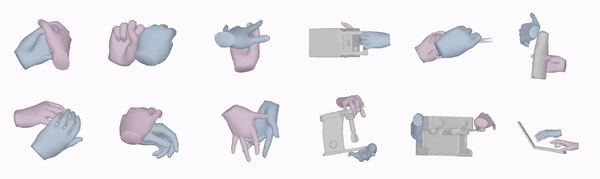

# 🤝 InterHandGen

## InterHandGen: Two-Hand Interaction Generation via Cascaded Reverse Diffusion (CVPR 2024) ##

[Jihyun Lee](https://jyunlee.github.io/)<sup>1</sup>, [Shunsuke Saito](https://shunsukesaito.github.io/)<sup>2</sup>, [Giljoo Nam](https://sites.google.com/view/gjnam)<sup>2</sup>, [Minhyuk Sung](https://mhsung.github.io/)<sup>1</sup>, [Tae-Kyun (T-K) Kim](https://sites.google.com/view/tkkim/home)<sup>1,3</sup>

<sup>1 </sup>KAIST,  <sup>2</sup> Codec Avatars Lab, Meta,  <sup>3</sup> Imperial College London

**[\[Project Page\]](https://jyunlee.github.io/projects/interhandgen/) [\[Paper\]](https://arxiv.org/abs/2403.17422) [\[Supplementary Video\]](https://youtu.be/DMGuQnHB5fg?feature=shared)**

<p align="center">
  
</p>


> We present 🤝**InterHandGen**, a novel framework that learns the generative prior of two-hand interaction. Sampling from our model yields plausible and diverse two-hand shapes in close interaction with or without an object. Our prior can be incorporated into any optimization or learning methods to reduce ambiguity in an ill-posed setup. Our key observation is that directly modeling the joint distribution of multiple instances imposes high learning complexity due to its combinatorial nature. Thus, we propose to **decompose the modeling of joint distribution into the modeling of factored unconditional and conditional single instance distribution**. In particular, we introduce a diffusion model that learns the single-hand distribution unconditional and conditional to another hand via conditioning dropout. For sampling, we combine anti-penetration and classifier-free guidance to enable plausible generation. Furthermore, we establish the rigorous evaluation protocol of two-hand synthesis, where our method significantly outperforms baseline generative models in terms of plausibility and diversity. We also demonstrate that our diffusion prior can boost the performance of two-hand reconstruction from monocular in-the-wild images, achieving new state-of-the-art accuracy.

&nbsp;

## Environment Setup  

1. Clone this repository and install the dependencies specified in `requirements.txt`.

<pre><code> $ git clone https://github.com/jyunlee/InterHandGen.git
 $ mv InterHandGen
 $ pip install -r requirements.txt </pre></code>

2. Install [ChamferDistancePytorch](https://github.com/ThibaultGROUEIX/ChamferDistancePytorch).

<pre><code> $ cd utils
 $ git clone https://github.com/ThibaultGROUEIX/ChamferDistancePytorch.git
 $ mv ChamferDistancePytorch
 $ python setup.py install </pre></code>

3. Install [functorch](https://github.com/pytorch/functorch).

 <pre><code> $ git clone https://github.com/pytorch/functorch.git
 $ mv functorch
 $ git checkout 1.10
 $ python setup.py install </pre></code>

&nbsp;

## Data Preparation 

1. Download InterHand2.6M dataset from [its official website](https://mks0601.github.io/InterHand2.6M/). 

2. Follow the data pre-processing steps of [IntagHand](https://github.com/Dw1010/IntagHand) (`dataset/interhand.py`). Note that you only need the shape annotation files (`anno/*.pkl`), and you can skip the image preprocessing parts.

3. Download MANO model from [its official website](https://mano.is.tue.mpg.de/). Place the downloaded `mano_v1_2` folder under `misc` directory.

   &nbsp;

## Network Training

Train your own two-hand interaction diffusion model using the following command. Note that the pre-trained weights can be downloaded from [this Google Drive link](https://drive.google.com/drive/folders/19Hbfuy7Vg2UVLMNMHbsMKApOS07EZ0lL?usp=drive_link). 

<pre><code> $ CUDA_VISIBLE_DEVICES={<i>gpu_num</i>} python interhandgen.py --train </pre></code>

&nbsp;

## Network Inference

Sample two-hand interactions from the trained model. 

<pre><code> $ CUDA_VISIBLE_DEVICES={<i>gpu_num</i>} python interhandgen.py --model_path {<i>trained_model_path</i>} </pre></code>

&nbsp;

<details>
  <summary>📌 Note on anti-penetration guidance (APG)</summary>
&nbsp;

<i>In the current code version, APG significantly increases sampling time due to the per-sample gradient computations, thus it is suppressed in the default setting. If you want to use APG, set `anti_pen` to `True` by modifying the config file (`configs/default.yml`). I will try to optimize this code part soon.</i>
</details>

## Evaluation

Compute the evaluation metrics using the sampled two-hand interactions.

<pre><code> $ cd eval
 $ CUDA_VISIBLE_DEVICES={<i>gpu_num</i>} python evaluate.py --sample_num {<i>number_of_samples</i>} --doc {<i>trained_model_dir</i>} </pre></code>

&nbsp;

## Citation

If you find this work useful, please consider citing our paper.

```
@inproceedings{lee2024interhandgen,
    title = {InterHandGen: Two-Hand Interaction Generation via Cascaded Reverse Diffusion},
    author = {Lee, Jihyun and Saito, Shunsuke and Nam, Giljoo and Sung, Minhyuk and Kim, Tae-Kyun},
    booktitle = {The IEEE Conference on Computer Vision and Pattern Recognition (CVPR)},
    year = {2024}
}
```

&nbsp;

## Acknowledgements

 - Parts of our code are based on [DiffPose](https://github.com/GONGJIA0208/Diffpose) (forward/reverse diffusion process), [Pointnet_Pointnet2_pytorch](https://github.com/yanx27/Pointnet_Pointnet2_pytorch) (feature extraction network for evaluation), [MoCapDeform ](https://github.com/Malefikus/MoCapDeform) (anti-penetration guidance), and [motion-diffusion-model](https://github.com/GuyTevet/motion-diffusion-model) (evaluation metrics). We appreciate the authors for releasing their codes.
